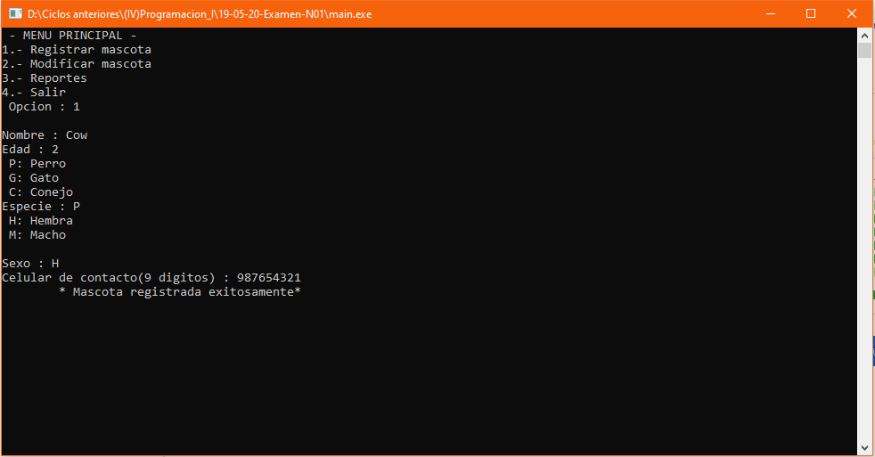
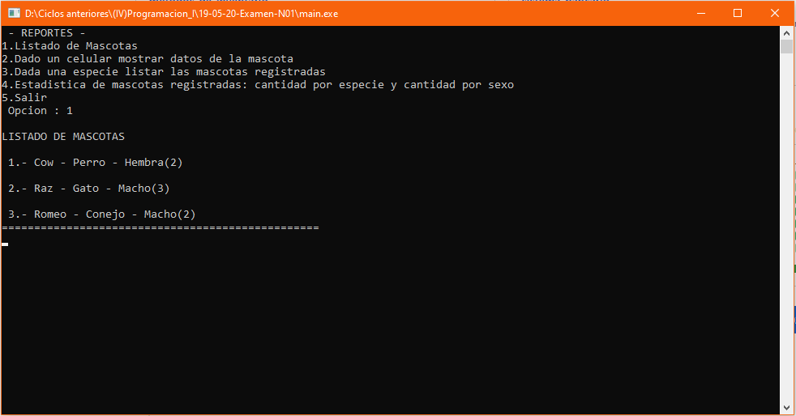

# Control de mascotas
Sistema de control de mascotas en una veterinaria que permite ingresar los datos de una mascota, modificar mascota; en los reportes tenemos un listado de las mascotas, mostrar una mascota según el celular de contacto, listar las mascotas según su especie, mostrar la cantidad de mascotas por especie y por género, **20/05/19**.

<strong>Imagen:</strong> Menú principal - Registrar Mascota.

<strong>Imagen:</strong> Menú de reportes - Listado de mascotas.

